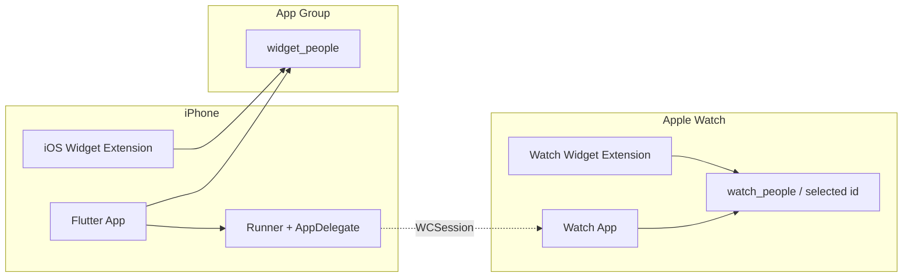
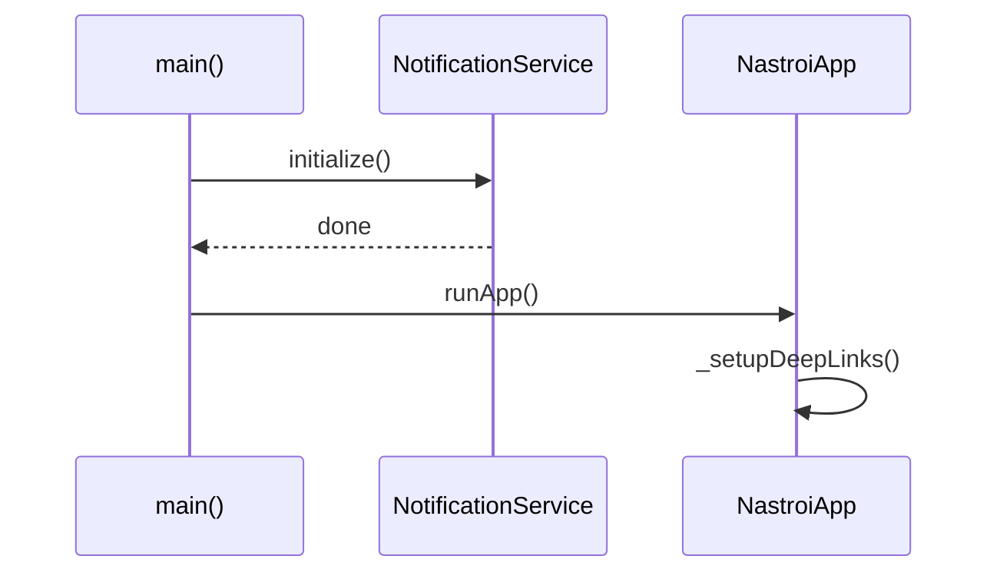
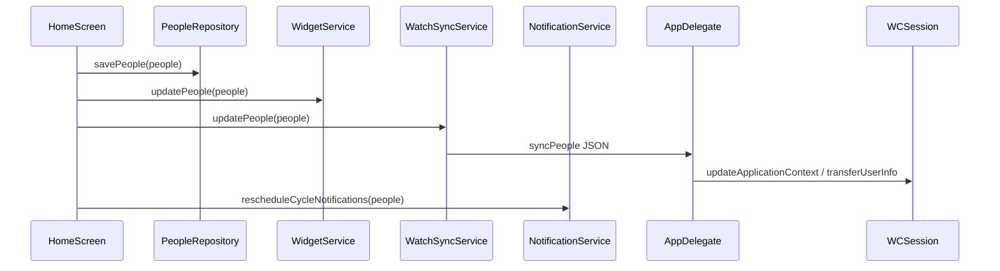
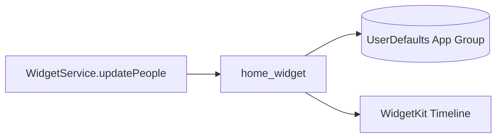
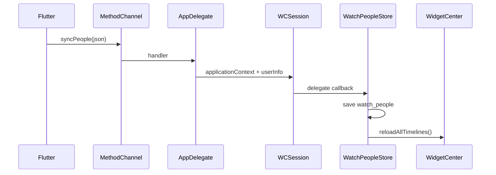
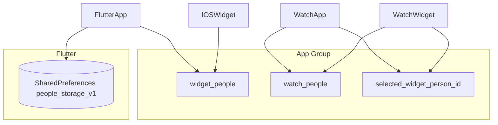
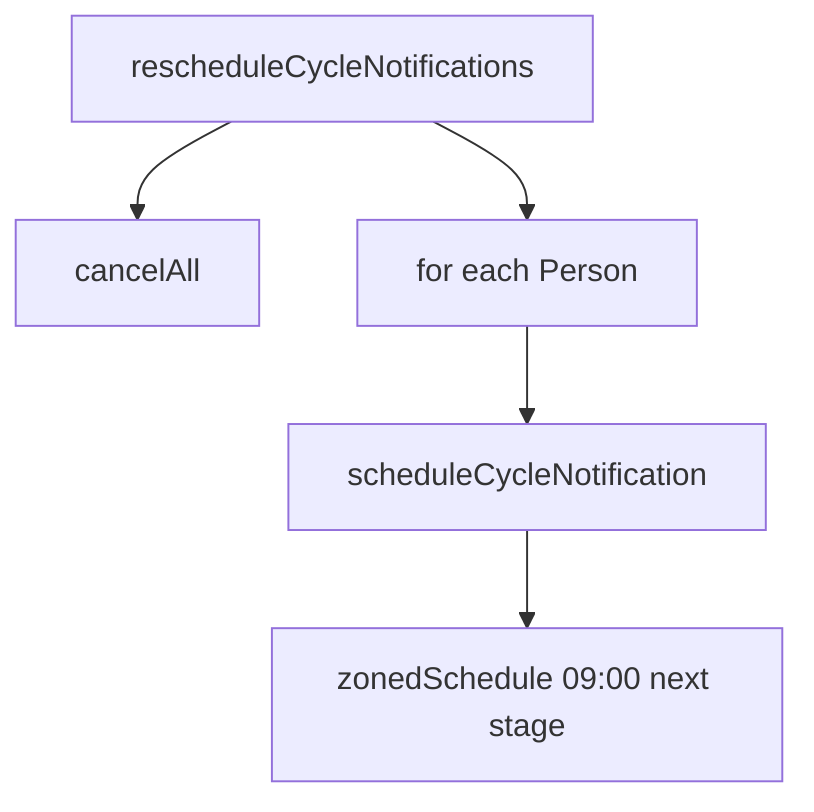

# Диаграммы

Mermaid-схемы для документации. Рендеринг зависит от просмотрщика Markdown (GitHub, VS Code и т.д.).

## Общая архитектура

Запись в **`widget_people`** из Flutter выполняется только цепочкой **`HomeScreen` → `WidgetService`** (стрелка «приложение → общее хранилище» на схеме упрощена).

## Запуск и инициализация Flutter

## Сохранение списка людей (HomeScreen)

Экран **`LinkPersonPreviewScreen`** при «Добавить» вызывает только **`PeopleRepository.savePeople`** — шаги **`WidgetService` / Watch / reschedule`** не выполняются.

## Обновление виджета iPhone

## Синхронизация с Apple Watch

## Хранилища данных

## Уведомления о цикле

